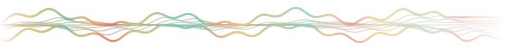

# Sill



**[sill website](https://ptthe13.github.io/sill/) · [download](https://github.com/PTthe13/sill/releases/latest)** — macOS 14+, universal, MIT.

A desktop system-load wave for macOS. It lives on one screen edge, on the
wallpaper, and draws a bundle of nine strands whose envelope is CPU and whose
fill is memory pressure. Click it for the numbers.

Requires macOS 14 or later. No dependencies, and it asks for no permissions —
nothing to approve, nothing installed, no helper.

Hover the band to read back what the machine was doing at that moment; click it
for the detail panel, which opens into whatever part of the desktop is free and
only comes forward when it would otherwise be hidden. It can run on one display or on every one.

Colour is load: green where the machine was idle, amber and red where it was
working, whenever that was. The wave also reads the wallpaper behind it, in
slices along its length, and adapts as it goes — bright strands over a dark
stretch of desktop, deep ones over a bright one, with a contrast hairline where
the wallpaper is busy. Nothing to configure.

## Install

Download the DMG from [Releases](https://github.com/PTthe13/sill/releases/latest), open it, drag Sill to Applications.

**The first launch will be blocked.** The app is signed with a Developer ID but
it is not notarised — Apple's notary service never saw this build — so macOS
refuses to open it until you say so explicitly:

1. Open Sill. macOS says it "could not be verified". Click **Done**.
2. Go to **System Settings → Privacy & Security**, scroll to the bottom.
3. Next to "Sill was blocked", click **Open Anyway**, and authenticate.
4. Open Sill again. It launches, and never asks again.

On macOS 14 the older right-click → **Open** shortcut still works. From macOS 15
onwards Apple removed it, so the System Settings route above is the only one.

Nothing else is installed: no helper, no background service, no login item
unless you switch one on in Settings. Deleting the app is the uninstall.

## What it costs

Measured, not estimated — one band, ten idle minutes, on an M-series Mac:

| | |
| --- | --- |
| CPU, idle | 0.26% of one core |
| Memory | 13 MB, or 20 MB once the detail panel has been opened |
| Download | 1.1 MB, universal, no runtime |
| Permissions | none — no Screen Recording, no Accessibility, no helper |
| While hidden | sampling stops when the band is covered, the display sleeps or the screen locks |

## Build

```bash
./Scripts/build-app.sh        # build/Sill.app (universal, ~700K)
./Scripts/make-dmg.sh         # build/Sill-1.0.dmg
swift run silltests           # the test suite
```

`Scripts/make-dmg.sh` produces an ad-hoc signed image. Distributing it needs a
Developer ID identity and notarisation — see the header of that script.

## Settings

Right-click the wave for the menu, or open Settings from it: edge, display,
show on every display, what the shape and the fill encode, colour ramp, what
sits behind the band (nothing, dark or glass), area fill, material, width,
dimming, sample interval, launch at login.

The wave draws two readings — its shape and its density — and you choose which:
CPU, memory, GPU, network or disk. A download shows up if you point the shape at
the network.
Everything persists in `app.sill.Sill`'s defaults.

The band spans 40% of the screen by default — of the height on the left and
right edges, of the width on the top and bottom. Hovering it fades in a chevron
pointing the way it opens.

## Command line

| Flag | What it does |
| --- | --- |
| `--probe` | prints a few CPU and memory readings, then exits |
| `--screens` | lists connected displays and their stable identifiers |
| `--render <dir>` | writes the golden images (one per edge x ramp) |
| `--shift a.png b.png …` | reports how far the band moved between screenshots |
| `--open` / `--close` / `--toggle` | drives the detail band of a running instance |
| `--reload` | re-reads defaults without a relaunch |
| `--login-check` | checks that Launch at login can actually register |
| `--backdrop` | reports how light and how busy each display's wallpaper is |
| `--preview <dir>` | draws the wave over each display's real wallpaper (`--all-ramps` for all five) |
| `--icon <dir.iconset>` | renders the app icon |
| `--hover [off]` | forces the hover hint on or off in a running instance |

See NOTES.md for build decisions and what was and wasn't verified.
